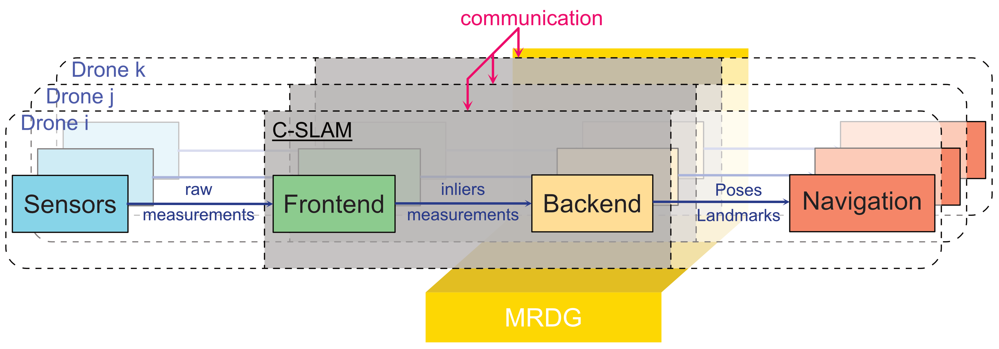
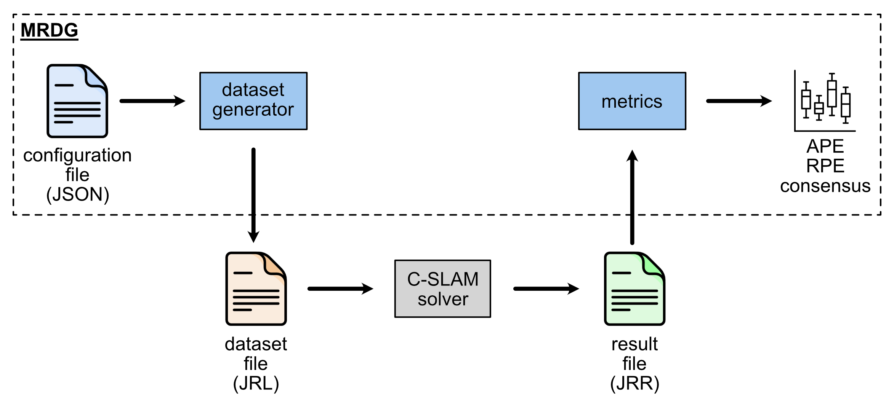

# MRDG
Multi-Robots Dataset Generator (MRDG) is a generator of datasets for multi-robots scenarios. It can generate data for C-SLAM backend algorithms.
MRDG is also able to compute errors from computed results.

<p align="center">

</p>

---

<p align="center">

</p>

---

## Installation

MRDG runs inside **Dev Containers** — no manual dependency installation is required. The only prerequisites are [Docker](https://docs.docker.com/get-docker/) and the [Dev Containers extension](https://marketplace.visualstudio.com/items?itemName=ms-vscode-remote.remote-containers) for VS Code.

### Steps

1. **Clone the repository**
   ```bash
   git clone https://github.com/tschweitzer57/MRDG.git
   cd MRDG
   ```

2. **Open in VS Code** and select the appropriate Dev Container when prompted (or via **Reopen in Container**):

   | Container | Purpose | Docker image |
   |---|---|---|
   | `dataset-gen-v3` | Dataset generation *(recommended)* | `tschweitzer57/gtsam:4.3a0-ros2jazzy-mirage` |
   | `dataset-gen` | Dataset generation (legacy) | `tschweitzer57/gtsam:base-20.04` |
   | `error-metrics` | Metrics computation & visualization | `tschweitzer57/gtsam:base-20.04` + `evo` |

3. **Wait for the container to build.** The workspace, helpers, scripts, configuration files, and output folders are automatically bind-mounted inside the container — no extra setup is needed.

---

## Usage

MRDG covers two main workflows: **dataset generation** and **metrics computation**.

### 1. Dataset generation

Open the `dataset-gen-v3` (or `dataset-gen`) Dev Container.

#### Generate a dataset from the default configuration

```bash
cd scripts
python gen-default.py
```

This generates a dataset using `2_Configurations/DEFAULT/default.json` (4 robots, 250 poses, 30 landmarks) and saves the output to `4_Datasets/`.

#### Generate datasets from a configuration folder

```bash
cd scripts
python gen-vld1.py
```

This iterates over all `.json` files in `2_Configurations/VLD1/` and generates one dataset per configuration.

#### Parse and visualize a generated dataset

```bash
cd scripts
python parse-dataset.py
```

#### Configuration format

Configuration files are JSON files located in `2_Configurations/`. The main parameters are:

```json
{
  "name": "my_dataset",
  "trajectory": {
    "robots": 4,
    "poses": 250,
    "seed": 0
  },
  "landmarks": {
    "number": 30,
    "detection_prob": 0.8
  },
  "intra-loop-closure": { "number": 10, "frequency": 5 },
  "inter-direct-loop-closure": { "pose": true, "range": true },
  "sigmas": {
    "odom": [0.01, 0.01, 0.01],
    "lc_pose": [0.05, 0.05, 0.05]
  },
  "outliers": {
    "false_matching": 0.05,
    "robot_loss": false
  }
}
```

See [`2_Configurations/DEFAULT/complete.json`](./2_Configurations/DEFAULT/complete.json) for the full list of available parameters.

---

### 2. Metrics computation

Open the `error-metrics` Dev Container. Place solver results (`.jrr.cbor` files) in `5_Results/Computed/` before running the scripts.

```bash
cd scripts
python TEST_4.py       # Compute errors across solver iterations
python BR_1_display.py # Display swarm consensus and landmark errors
```

Output metrics are saved to `5_Results/Metrics/` and plots to `5_Results/Display/`.

## Repository structure

- [Documentation](./0_Documentation) : Contains MRDG documentation and images
- [Generator](./1_Generator) : Contains datasets generation helpers and scripts for different scenarios
- [Configurations](./2_Configurations) : Contains configuration files for generation helpers and scripts
- [Metrics](./3_Metrics) : Contains metrics helpers and script to display errors
- [Datasets](./4_Datasets) : Contains generated datasets
- [Results](./5_Results) : Contains computed results (errors and graphs)

---

## Future improvements

[Todo list](./TODO.md)
